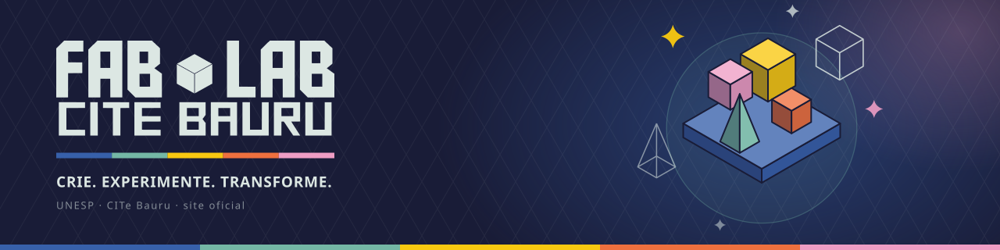

<div align="center">
  
  <p><strong>A gamified community platform for the UNESP Fab Lab in Bauru, Brazil — where makers publish projects, share 3D models, learn, and level up a pixel-art avatar.</strong></p>
  <p>
    
    
    
    
    
    
  </p>
</div>

---

🕹️ **CRIE. EXPERIMENTE. TRANSFORME.**

This repository builds the official website of
[Fab Lab CITe Bauru](https://www.bauru.unesp.br/#!/citeb/fab-lab) (UNESP) — designed as
a game, wrapped in an isometric pixel-art identity with the lab drawn as a night-time
game map:

- 👾 Every volunteer gets a customizable **pixel-art avatar**.
- ⭐ **XP** is earned by watching classes and publishing projects, 3D models and articles.
- 🛠️ Five **skills** level up through play — 3D modeling, laser cutting, 3D printing,
  electronics and design.
- 🎯 **Missions** curated by the lab team feed a collective **lab level** 🏆.

🔓 The platform is **open by culture**: reading, watching classes and downloading 3D
models require no account. An account is for *making* — publishing, liking, and
earning XP.

> 🚧 **Status: specification complete, implementation not started.** The product is fully
> specified through five designer decision rounds and a product-owner decision log — every
> page has a design source and dated decisions. Start with
> [`docs/product/concept.md`](docs/product/concept.md) (vision + information architecture),
> [`docs/tech-stack.md`](docs/tech-stack.md) (architecture decision record) and
> [`docs/sdd-strategy.md`](docs/sdd-strategy.md) (implementation roadmap).

## 🎮 Features (as specified)

| Area | What it does |
|---|---|
| 🏠 **Home** | Pixel-art isometric map of the lab as hero (dedicated mobile art), featured missions with per-maker progress, collective lab level, maker ranking, latest projects |
| 🧊 **Biblioteca 3D** | Community 3D model library — browse by theme tags, in-browser 3D preview, open downloads (STL/3MF/OBJ/GLTF, images, PDF, ZIP) |
| 🛠️ **Projetos** / ✍️ **Artigos** | Galleries of maker-built projects and articles, filterable, with author attribution |
| 🎓 **Aulas** | Video courses (YouTube embeds) with difficulty levels and per-user progress; watching a full video earns XP |
| 📅 **Calendário** | Lab activities and events |
| 👾 **Avatar builder** | 2-step signup: build a pixel avatar (20 skin tones, 30 haircuts, 10 hair colors, outfits, accessories, F/M base) then fill personal data |
| 🎒 **Minha Conta** | Avatar + skills dashboard, my projects/models/articles, watched courses |
| ⭐ **Gamification** | Transparent economy: 1 XP per action, 5 XP per level, level cap 10; skills start at level 0 and grow only through play; content goes through a team **review queue** (XP credits on approval) |
| 🏢 **Multi-tenant** | The platform can host other fablabs/makerspaces: per-organization content, XP, rankings and skill catalogs; master and org-admin roles |

## 🎯 Goals

1. 🔨 **Aprenda fazendo** — learn by making: classes, missions and real projects.
2. 📖 **Compartilhe conhecimento** — an open, SEO-friendly showcase of everything the
   community builds, in the spirit of the global FabLab culture ("if you document
   everything you do, the knowledge stays").
3. 🚀 **Desenvolva projetos reais** — give student volunteers real authorship, identity and
   progression, and give the lab a durable public memory.

## 🏗️ Architecture

Decided by adversarial panel review (three candidate stacks × three judging lenses),
re-validated against an external Astro/Supabase proposal — full records in
[`docs/tech-stack.md`](docs/tech-stack.md) and
[`docs/tech-stack-benchmark.md`](docs/tech-stack-benchmark.md).

| Layer | Choice |
|---|---|
| Framework | **Next.js (App Router/RSC) + Payload CMS 3** embedded in one app (admin at `/admin`) |
| Language | TypeScript end to end |
| Database | **PostgreSQL** (Payload Postgres/Drizzle adapter) |
| Object storage | S3-compatible: **MinIO** self-hosted ↔ S3/R2 managed, swappable by env |
| 3D preview | `@google/model-viewer` (GLB/GLTF) + `three` loaders (STL/OBJ/3MF), lazy client islands |
| Game rendering | DOM/CSS with `image-rendering: pixelated` — designer-produced sprite sheets, layered paperdoll avatar, server-side composited miniatures (no canvas engine) |
| Deploy | Docker Compose on a campus VM; images built in CI |

```
apps/web/          Next + Payload (public frontend + admin + API)
packages/game/     pure XP/level/mission rules — plain TS, tested, no Payload imports
packages/ui/       identity design tokens + base components
infra/             docker-compose, Caddyfile, backups, runbooks
```

**Multi-tenancy is a property of the data, never a deploy mode**: row-level tenancy via
the official `@payloadcms/plugin-multi-tenant`; a sovereign self-hosted instance is just
a deploy with one organization and no master user. Cross-tenant isolation is enforced by
a single query choke point plus a CI leak-test harness — the full principle list lives in
the multi-tenancy section of [`docs/tech-stack.md`](docs/tech-stack.md).

## 🗂️ Repository layout

```
docs/
├── product/               Product vision — the spec-generation sources
│   ├── concept.md           Vision, IA, audiences, platform requirements
│   ├── gamification.md      Game rules: XP economy, skills, missions, decisions log
│   ├── visual-identity.md   Palette, typography, art direction, UI patterns
│   ├── pages/               One spec per page (desktop faithful to mockups
│   │                        + tablet/mobile adaptations + CMS content models)
│   ├── design/              Designer mockups, named by page (source of truth for UI)
│   ├── fonts/               Identity typefaces (Comfortaa OFL bundled; others fetched — see its README)
│   └── exports/             Designer communication (Q&A rounds, art checklist)
├── tech-stack.md          Architecture decision record (incl. multi-tenancy design)
├── tech-stack-benchmark.md  Verified benchmark vs. Astro/Supabase proposal
├── sdd-strategy.md        Implementation roadmap (spec-driven development)
├── backlog.md             Out-of-band issues (ISS-001 font licenses, ISS-002 terms)
└── references/            FabLab culture reference material
```

## 🗺️ Roadmap — the quest log

Implementation follows a spec-driven pipeline (feature → spec → plan → tasks → code),
detailed in [`docs/sdd-strategy.md`](docs/sdd-strategy.md):

| # | Feature | Summary |
|---|---|---|
| 000 | 🏢 `fundacao-multi-tenant` | Tenancy plugin, organizations, roles, isolation harness |
| 001 | 🎨 `design-system-shell` | Design tokens (CSS custom properties, zero hex literals in components), base components, responsive shell |
| 002 | 🗃️ `cms-conteudo` | Collections, multi-format uploads (presigned + post-upload validation), moderation |
| 003 | 🌐 `paginas-publicas` | All public pages, 3D preview, performance budget measurement |
| 004 | 👾 `contas-avatar` | Signup, avatar builder, login, Minha Conta, LGPD |
| 005 | ⭐ `gamificacao` | XP ledger, skills catalog (org-manageable), missions, rankings |
| 006 | 🏠 `home-gamificada` | Logged-in home with missions, ranking and lab level |
| 007 | 🚪 `onboarding-de-orgs` | Org onboarding wizard — gated on a signed agreement + a real second lab |

## 🤝 Contributing

The project is documentation-first — the docs are the contract (and yes,
contributions earn you real-life XP ⭐):

- **Content is PT-BR; code and commits are English.** Product docs live in
  `docs/product/` and every decision is dated (`**Decidido (…, YYYY-MM-DD):**`);
  anything not backed by a mockup or a decision is marked `(proposta)`. Please keep
  those conventions — they are how this project survives contributor rotation.
- **Decisions have provenance.** Superseded content is struck through, never deleted;
  mockups remain the historical record even when decisions override them.
- **Before coding**, read `docs/sdd-strategy.md` — features go through spec/plan/tasks
  with human review gates; quality bars (function/file size limits, tests, security
  scans for upload/auth surfaces) are non-negotiable.
- Open items live in [`docs/backlog.md`](docs/backlog.md); page-level open questions live
  in each spec's *Questões em aberto* section.

## 🏅 Credits

**Main contributors:** [sophiabort](https://github.com/sophiabort) 🎨 Product leader & design · [John Ariedi](https://github.com/joaoariedi) 🛠️ Engineering

- **Design & art** — visual identity, mockups and all pixel-art/sprite production by
  [sophiabort](https://github.com/sophiabort).
- **FabLab culture** — values inspired by the
  [Makers' Guide for Making](http://makersguideformaking.com) poster series
  (WeFab / Estúdio Arnold, São Paulo, 2016).
- Built at **CITe Bauru — UNESP** (Universidade Estadual Paulista).

## 📜 License

Code and documentation are released under the **[MIT License](LICENSE)** (decided
2026-08-25) — aligned with the multi-tenant "self-host distribution" door: any
fablab/makerspace may run its own instance.

**Exceptions** (not MIT): the Fab Lab CITe Bauru **visual identity, mockups, brand
assets and pixel art** (`docs/product/design/`, `docs/product/brand/`) are © their
authors, used here with permission — reuse them only for this project. Typefaces keep
their own licenses: Comfortaa is OFL (bundled); Aldo the Apache and SquareFont are
dafont "100% Free" but are **not redistributed** in this repository — see
[`docs/product/fonts/README.md`](docs/product/fonts/README.md).
